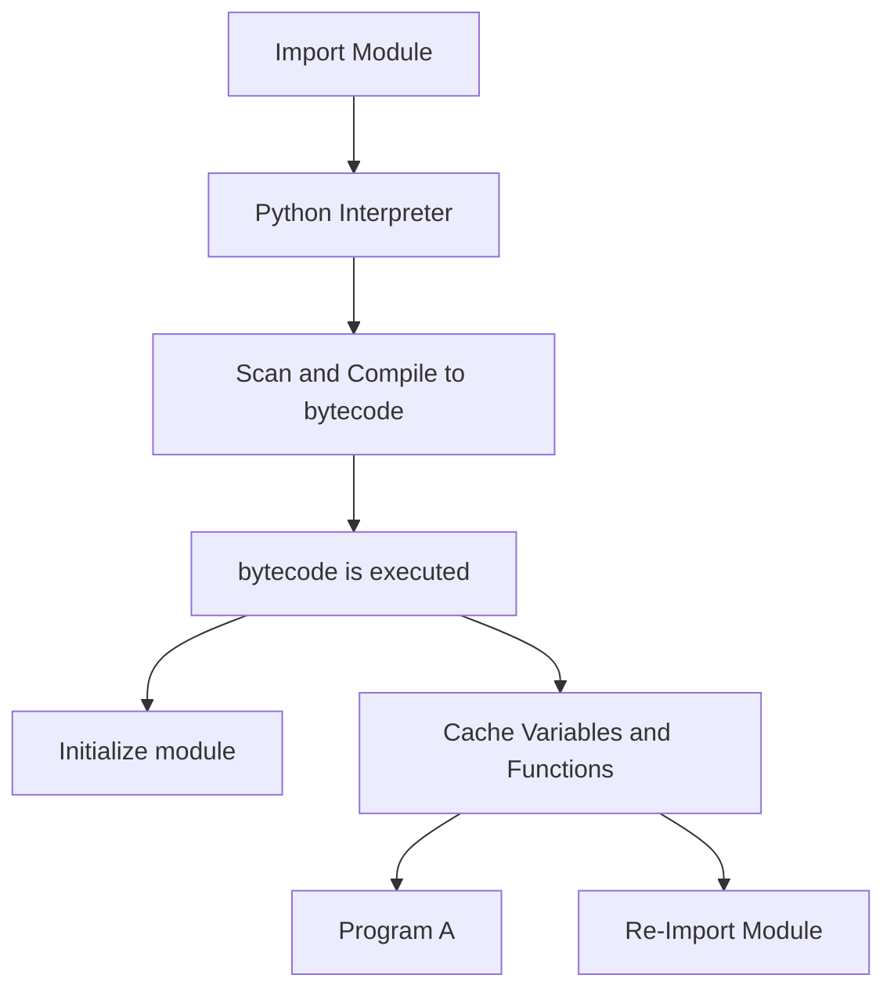

## What is Modules and Packaging 
In Programming , module helps organize your code . Each module performs a specific functionality of an application. 
For example a ping pong game can have 2 modules , one for the logic and another for how to draw the game . 
Each module consists of a different file , and can be edited seperately.

## How to create Modules

Every python file is a module and file name is considered the module name

## What does a module have

Python Module can have a set of

     1.    Functions
     2.    Classes
     3.    Variables
    
defined and implemented 

## Useage of module

Step 1: Import Module
Modules are imported from other modules using the import command.
If the file name is not found in the folder , python interpreter will look for  in-built modules

    ex: import draw

Step 2: Using a function from module 
Below example draw is the module imported and draw_game is the function from draw module

    ex : draw.draw_game()

## Create a sample application to demonstrate Modules 

We will develop a gaming application with 2 modules .
mygame/draw.py
mygame/game.py

The Python script game.py implements the game. It uses the function draw_game from the file draw.py, or in other words, the draw module that implements the logic for drawing the game on the screen.

## Importing module objects to the current namespace

from draw import draw_game

    def main():
        draw_game(result) 
        # Name of the module is not refered anymore

Advantage of using namespace over module is that you do not refer the module name everytime you use the function
Disadvantage is that we cannot have two objects with the same name in the namespace .

## Import all objects from module
    from draw import *

    def main():
        draw_game(result) 
        # Again Name of the module is not refered anymore

## Module initialization

In Python a module is initialized when its imported for the first time into a running python code .

What happens when the module is imported :

1.  Python scans the code and compiled into bytecode
2.  bytecode is then executed , which runs the modules code and initializes its variables and functions
3.  once a module is initialized , python keeps a cache of modules

4.  Any new Program which imports the module , will simply retrieve it from the cached module object .
5.  If the imported module is not available in the module cache , python will initialize the module.
   

## Extending module load path

As we know , python interpreter looks for the modules first in the same folder if not found looks for it in in-built modules .
There are couple of way to tell python interpreter to look for modules in specific directories .

    PYTHONPATH=/foo python game.py

This executes game.py, and enables the script to load modules from the foo directory, as well as the local directory.

## Explore build-in modules

Import a build-in module ,which helps create ,read data from URLs 

    import urllib

We can look for functions within the module using dir function

    dir(urllib)

We can read more about the function using help function

    help(urllib.urlopen)

## Write packages

Packages are directories containing modules and/or packages . 

Each package MUST have a file called "__init__.py". This file can be an empty file .
This file indicates that the directory is a python package .

We can import the package the same way we import a module .

Example : create a package called "foo" and a module "bar" 

    mkdir foo
    touch foo/__init__.py
    vi foo/bar.py

    import foo.bar   # We have to use the foo prefix everytime the module bar is used
    or
    from foo import bar  # Here we can just refer to the module bar 

 The __init__.py file can also decide which module can be accessed externally while keeping other internal .

    __init__.py

    __all__ = ["bar"]